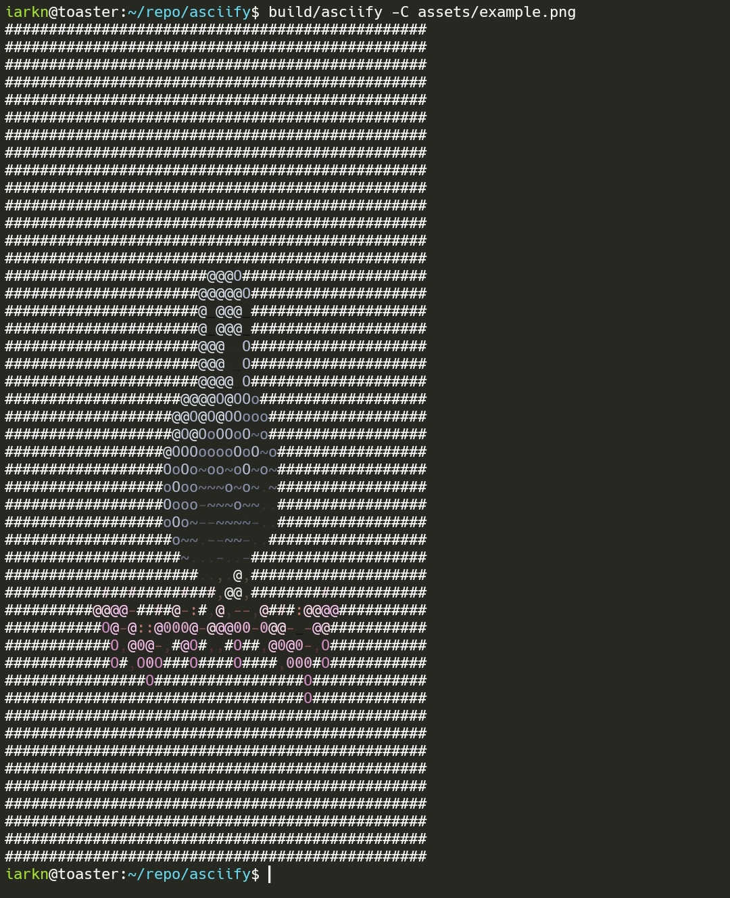

# asciify

An attempt at making a program that converts images to ASCII characters.

## Usage

```
Usage: bin/asciify [options ...] file
      --help            show this information
  -v, --verbose         be verbose
  -c, --chars <string>  set output characters from dark to light
  -s, --scale <float>   set scaling of the image and text output
```

## Example

Below is the result of converting [this](assets/example.png) image into an ASCII-art.



## Building

You would need a compiler for C (like `clang` or `gcc`) and `make`. To compile, just type `make` in the root directory and the build output should be in the `bin/` directory.

## License

[MIT](LICENSE)
